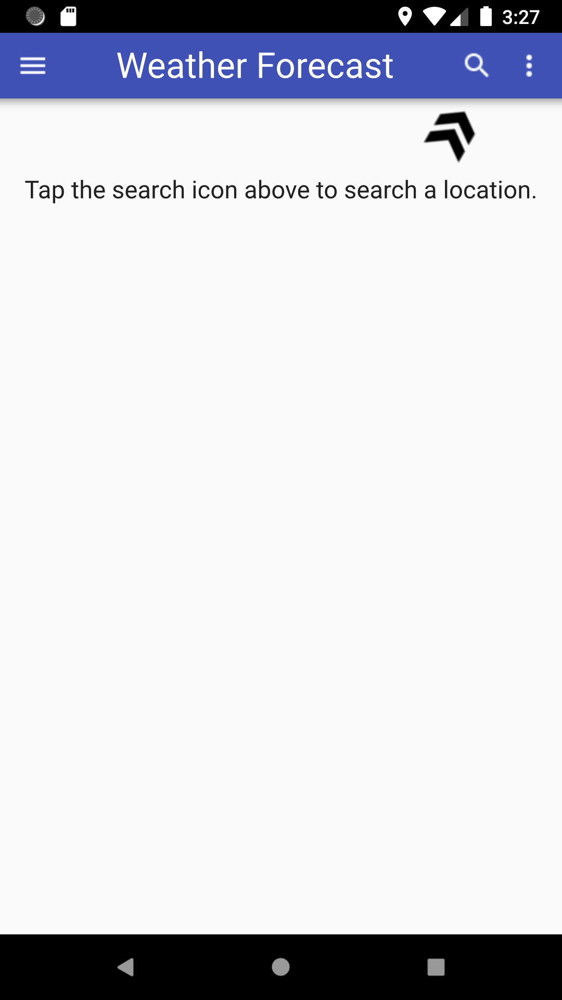
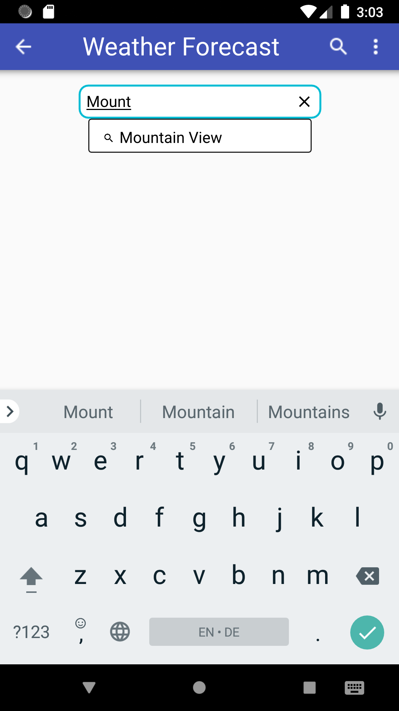
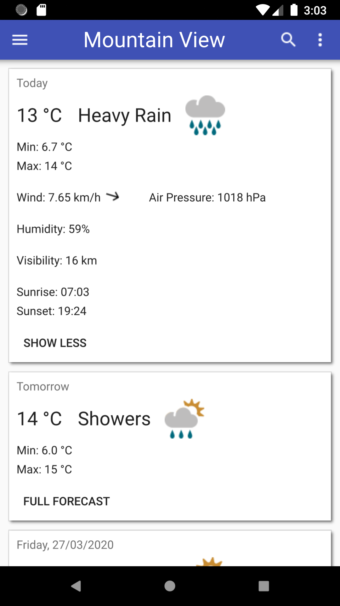
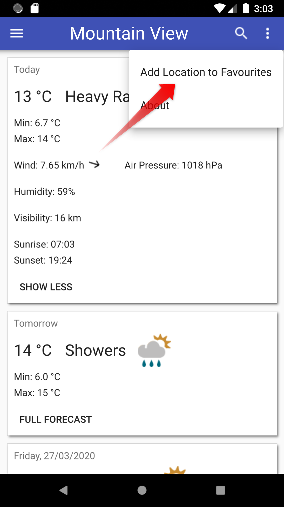
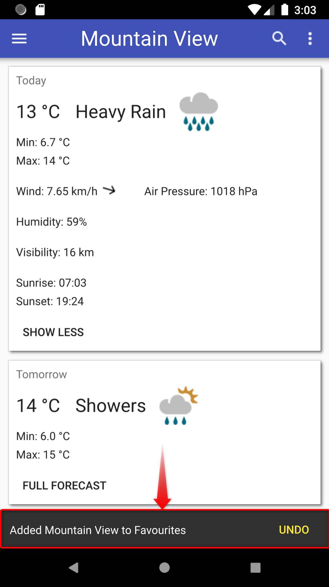
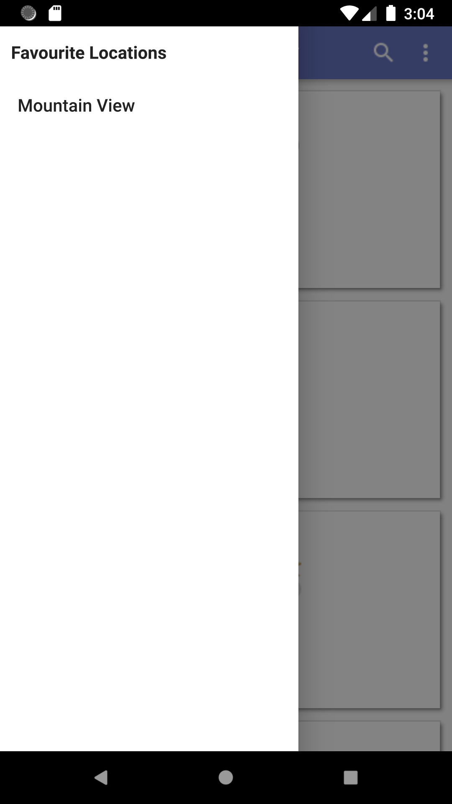

# Mobile Weather
A simple weather app in C++ and QML demonstrating how to talk to REST APIs with Qt

This app was developed for a CS project when I was studying. It very much fulfilled the requirements meaning you can actually search for your city and get a (more or less accurate) weather forecast for the next 5 days.

## Getting Started
To build the app yourself you have to recursively clone the project to also pull in the `android_openssl` dependency:
```shell
$ git clone --recursive https://github.com/FMeinicke/Weather-App.git
```
Or, if you cloned the project regularly, don't forget to initialise the submodules:
```shell
$ git clone https://github.com/FMeinicke/Weather-App.git
$ cd Weather-App/
$ git submodule update --init
```
Then simply open the `Weather-App.pro` file in QtCreator and compile and run as usual (be sure to deploy the application to the emulator or phone before running it).

## Features
- When starting the app 
  - your location will be detected via GPS (if you've given the app permission to do so) *or*
  - if the app is not allowed to use GPS, it tries to load the weather data for the last used location *or*
  - if none of the above worked, you will be prompted to search for a location yourself.
- Searching for a specific location (because the API I used does not provide very detailed weather data for every place on earth you might need to try a bigger location near you to get an approximate forecast)
- Weather forecast for the current and 5 days in the future
- Switching between an overview (including the current weather state and temperatures for the day) and a detailed forecast (including humidity, wind, sunrise/sunset times, ...)
- Saving the current location as favourite for quick access from the drawer (swipe right from the left edge of the screen to show)
- Multi-language support (currently just English and German)

## Screenshots
<div>
  
  
  
</div>

<div>
  
  
  
</div>

## Issues that occurred during development and how I solved them
### Missing (or not found) OpenSSL libraries on Android
#### Issue:
- no way to communicate with HTTPS APIs out of the box
- the following error occurred:
    ```
    qt.network.ssl: QSslSocket::connectToHostEncrypted: TLS initialization failed
    ```

#### Solution:
- the necessary OpenSSL libraries have to be delivered with the app (i.e. the .pro file should have a `ANDROID_EXTRA_LIBS` section)
- KDAB provides those necessary libraries along with a .pri file that can be easily included into your project (https://github.com/KDAB/android_openssl):

    ```qmake
    include(third_party/android_openssl/openssl.pri)
    ```

### Wrong font on OnePlus phone
#### Issue:
- on OnePlus phones the default application font is ignored (cf. https://bugreports.qt.io/browse/QTBUG-69494)

#### Workaround:
- the font has to be delivered with the app (using Qt's resource system)
- in your main.cpp you can then load the font and set it as globale font
  ```cpp
  QGuiApplication app(argc, argv);
  const auto id = QFontDatabase::addApplicationFont(":/fonts/Roboto/Roboto-Regular.ttf");
  const auto family = QFontDatabase::applicationFontFamilies(id).at(0);
  app.setFont({family, 16});
  ```

### Translating dynamic strings
#### Issue:
- the API returns the weather state as an English description
- since those strings cannot be known during development they can't be translated using QtLinguist

#### Solution:
- use a `QMap` to map the strings that I receive from the API to the translated strings
  (I know all of the possible strings from the API docs)
  ```cpp
  void CWeatherDataModel::setupWeatherStateTranslations()
  {
      if (m_WeatherStateTranslations.size() != 0)
      {
          return;
      }
      m_WeatherStateTranslations["Snow"] = tr("Snow");
      m_WeatherStateTranslations["Sleet"] = tr("Sleet");
      m_WeatherStateTranslations["Hail"] = tr("Hail");
      m_WeatherStateTranslations["Thunderstorm"] = tr("Thunderstorm");
      m_WeatherStateTranslations["Heavy Rain"] = tr("Heavy Rain");
      m_WeatherStateTranslations["Light Rain"] = tr("Light Rain");
      m_WeatherStateTranslations["Showers"] = tr("Showers");
      m_WeatherStateTranslations["Heavy Cloud"] = tr("Heavy Cloud");
      m_WeatherStateTranslations["Light Cloud"] = tr("Light Cloud");
      m_WeatherStateTranslations["Clear"] = tr("Clear");
  }
  ```
- in a custom `tr` method the received strings from the API can be properly translated
  ```cpp
  QString CWeatherDataModel::weatherTr(const QString& s) const
  {
      if (m_WeatherStateTranslations.contains(s))
      {
          return m_WeatherStateTranslations[s];
      }
      else
      {
          return s;
      }
  }
  ```
